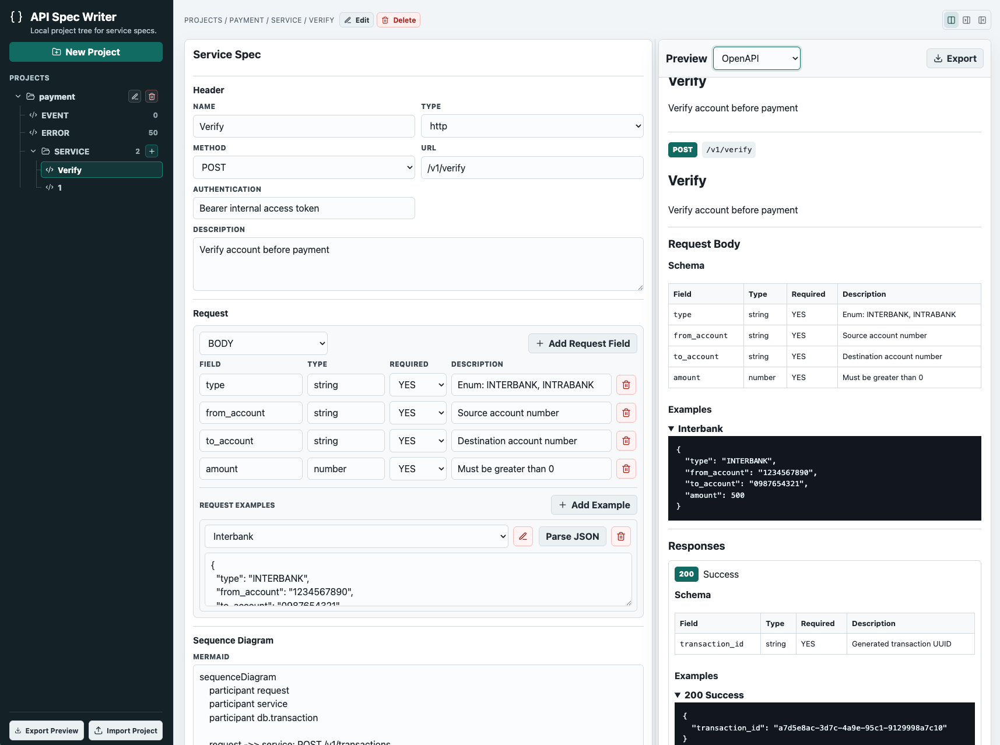

# API Spec Writer

Browser-based platform for writing API/service specifications, project event codes, and project error codes.

Try it here:

https://api-spec-writer.witwoywhy.cc/

## Features



- Create and manage projects.
- Add and edit event codes.
- Add and edit error codes grouped by domain.
- Create and edit services.
- Support service types: `http`, `publisher`, `subscriber`, and `scheduler`.
- For HTTP services, document method, URL, request fields, response fields, examples, errors, sequence diagrams, and field mappings.
- Parse JSON examples into request/response field rows.
- Preview service specs with selectable preview options:
  - Markdown
  - HTML
  - OpenAPI
  - Go Struct
- Export project previews by selected preview type.
- Store project metadata in browser storage and project details in selected JSON project files.

## Tech Stack

- Frontend: React + Vite
- Backend: none
- Storage: browser local storage, IndexedDB file handles, and selected project JSON files

## Local Development

```bash
cd frontend
npm install
npm run dev
```

The dev server runs on `127.0.0.1`. Open the URL printed by Vite.

## Build

```bash
cd frontend
npm run build
```

The production output is written to `frontend/dist`.
